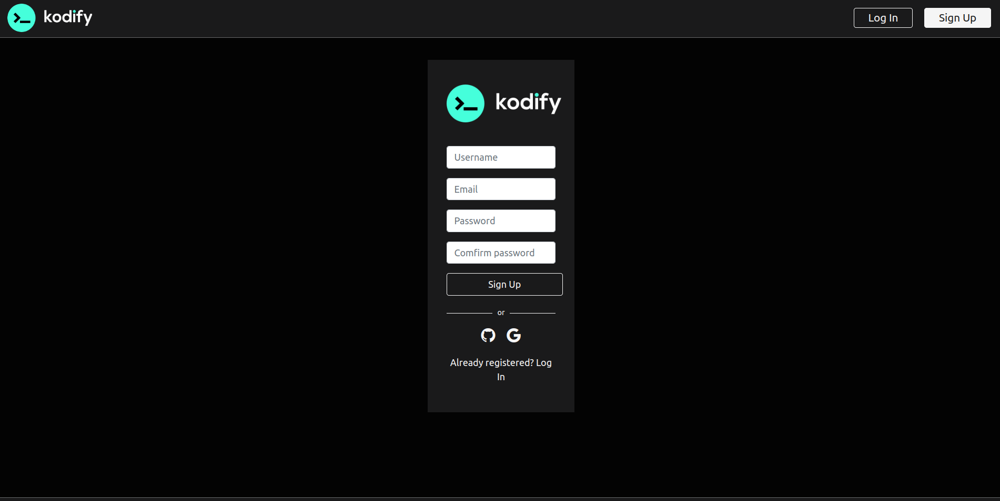
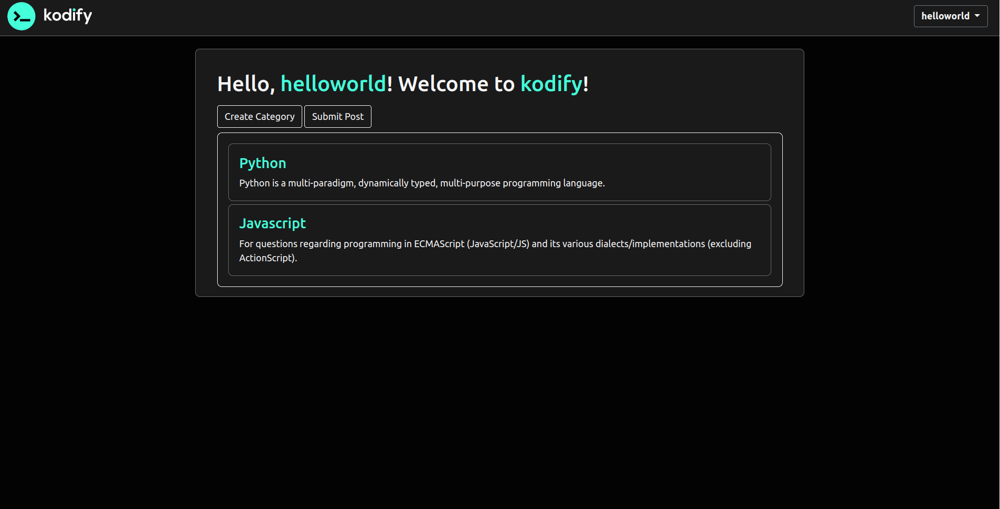
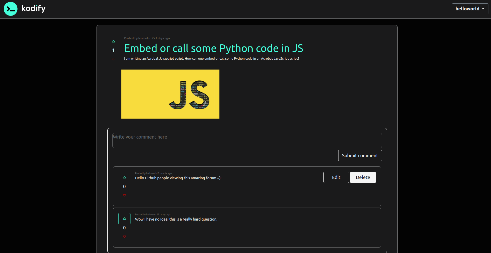
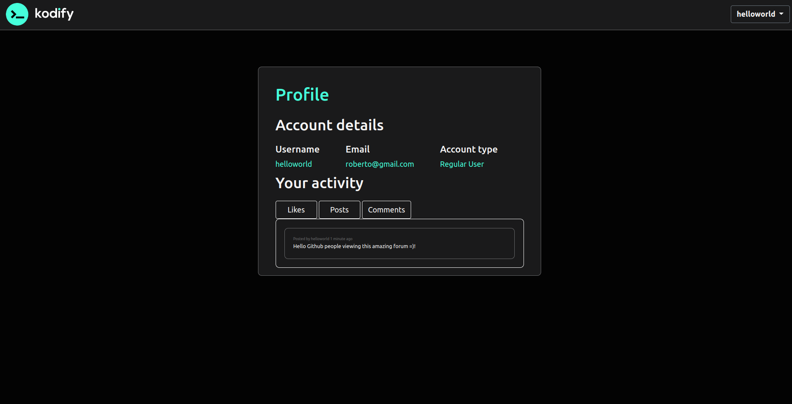
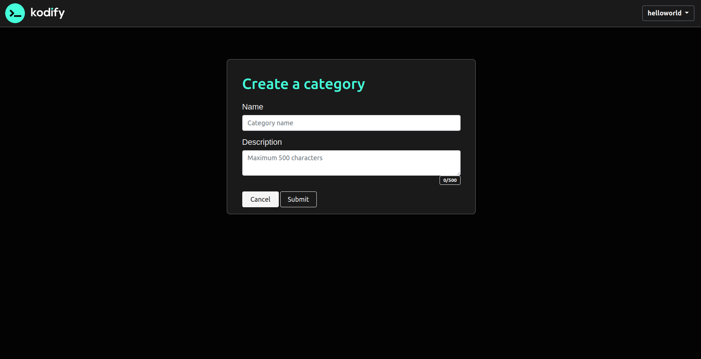
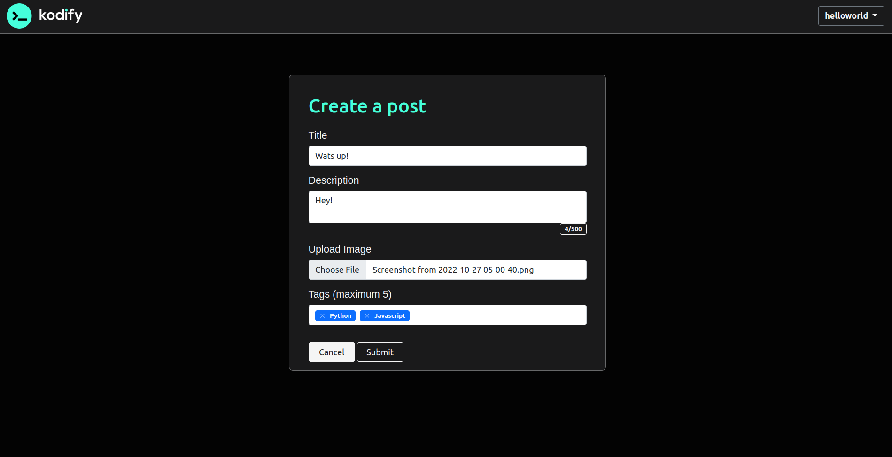

# golang-forum

## Table of Contents
- [golang-forum](#golang-forum)
  - [Table of Contents](#table-of-contents)
  - [General Information](#general-information)
  - [Features](#features)
  - [Technologies Used](#technologies-used)
  - [Team \& My Work](#team--my-work)
  - [Main Learnings](#main-learnings)
  - [Setup](#setup)
  - [Images](#images)

## General Information
This project was made as a school project in [kood/Jõhvi](https://kood.tech/) (01.19.2022)

The project required us to create a fully functional forum with backend and frontend using Golang.

We also had to implement a DBMS which had to be SqLite.

**NB! Different source control platform was used hence no commit history.**


## Features
- Authentication
- Categories, posts & comments
- Likes
- Post filtering
- Image upload


## Technologies Used

[Golang](https://go.dev/)

[SQL](https://en.wikipedia.org/wiki/SQL)

[SqLite](https://www.sqlite.org/index.html)

## Team & My Work
In this project I was in a team of 5 with 4 other students from kood/Jõhvi.

I was responsible for:
- designing and implementing the frontend
- containerizing the application

## Main Learnings
- Basics of UI/UX 
- Basics of Templating

## Setup
Clone the repository
```
git clone https://github.com/JesusKris/golang-forum.git
```
Run the server
```
go run cmd/web/*.go
```
## Images





